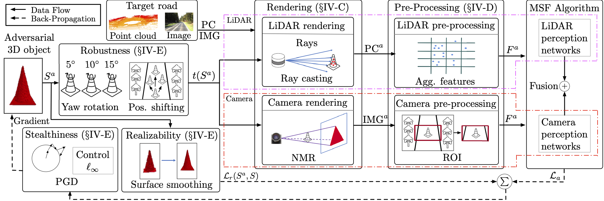

# MSF-ADV
MSF-ADV is a novel physical-world adversarial attack method, which can fool the Multi Sensor Fusion (MSF) based autonomous driving (AD) perception
in the victim autonomous vehicle (AV) to fail in detecting a front obstacle and thus
crash into it.

## Parper

Invisible for both Camera and LiDAR: Security of Multi-Sensor Fusion based Perception in Autonomous Driving Under Physical-World Attacks

Author: Yulong Cao*, Ningfei Wang*, Chaowei Xiao*, Dawei Yang*, Jin Fang, Ruigang Yang, Qi Alfred Chen, Mingyan Liu, Bo Li (*Co-first authors)

Website: https://sites.google.com/view/cav-sec/msf-adv



This is the code for the paper [Invisible for both Camera and LiDAR: Security of Multi-Sensor Fusion based Perception in Autonomous Driving Under Physical-World Attacks](https://www.computer.org/csdl/proceedings-article/sp/2021/893400b302/1t0x9btzenu) accepted by IEEE S&P 2021.

The arxiv link to the paper: https://arxiv.org/abs/2106.09249

## Installation
Install the required environments with the requirements.txt file using [ANACONDA](https://www.anaconda.com/products/individual)
```
$ conda env create -f requirements.yml
```

## Command line
### Download the target model
You can find the model through the [official Baidu Apollo GitHub](https://github.com/ApolloAuto/apollo) and [YOLO website](https://pjreddie.com/darknet/yolo/). Or you can download the model [here](https://drive.google.com/file/d/17Eg1ySmucr1UQfye5wxAgGpv6VN5R0FP/view?usp=sharing) and then unzip it to `./data` folder.

### Generating the adversarial object

 ```
 python attack.py [-obj] [-obj_save] [-lidar] [-cam] [-cali] [-e] [-o] [-it] 
 ```

| Argument | Description |
| -------- | ----------- |
| `-e` | Constrained max changing for the object vetex|
|`-o` | Optimization method: pgd and adam |
|`-it` | Max iteration number |
|`-obj` | Initial benign 3D object path |
|`-obj_save` | Adversarial 3D object saving dir |
|`-lidar` | LiDAR point cloud data path |
|`-cam` | Camera image data path |
|`-cali` | Calibration file path |

### Example for generating the adversarial object

 ```
 python attack.py -obj ./object/object.ply -obj_save ./object/obj_save -lidar ./data/lidar.bin -cam ./data/cam.png -cali ./data/cali.txt -e 0.2 -o pgd -it 1000 
 ```

 ### Evaluation
 The source code for evaluating the generated adversarial 3D object are in evaluation folder.

## Citation
 If you use this code for your research, please cite our papers.

```
@inproceedings{sp:2021:ningfei:msf-adv,
  title={{Invisible for both Camera and LiDAR: Security of Multi-Sensor Fusion based Perception in Autonomous Driving Under Physical World Attacks}},
  author={Yulong Cao and Ningfei Wang and Chaowei Xiao and Dawei Yang and Jin Fang and Ruigang Yang and Qi Alfred Chen and Mingyan Liu and Bo Li},
  booktitle={Proceedings of the 42nd IEEE Symposium on Security and Privacy (IEEE S\&P 2021)},
  year={2021},
  month = {May}
}
```
```
@inproceedings{xiao2019meshadv,
  title={{MeshAdv: Adversarial Meshes for Visual Recognition}},
  author={Xiao, Chaowei and Yang, Dawei and Li, Bo and Deng, Jia and Liu, Mingyan},
  booktitle={Proceedings of the IEEE/CVF Conference on Computer Vision and Pattern Recognition},
  pages={6898--6907},
  year={2019}
}
```

## Acknowledgments
Our code is inspired by [Towards Robust LiDAR-based Perception in Autonomous Driving: General Black-box Adversarial Sensor Attack and Countermeasures](https://www.usenix.org/system/files/sec20_slides_sun.pdf
), [Mitsuba Physically Based Renderer](https://github.com/mitsuba-renderer), [neural_renderer](https://github.com/hiroharu-kato/neural_renderer), [pytorch-caffe](https://github.com/wwwanghao/caffe2pytorch), and [PerceptualSimilarity](https://github.com/richzhang/PerceptualSimilarity).